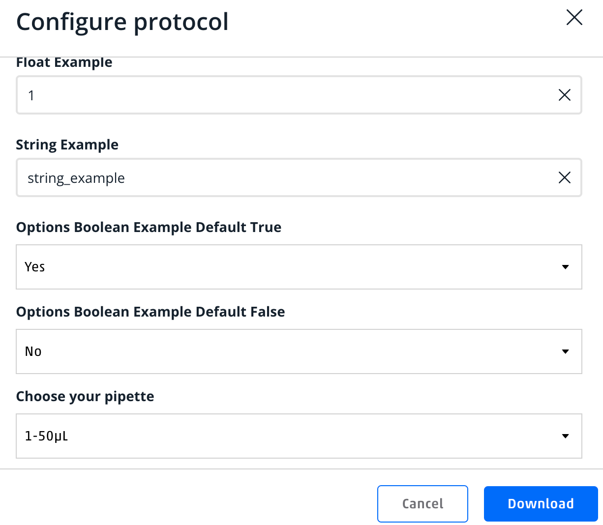

# Template for Protocol Library Parameters

Until we have built in protocol parameterization this pattern allows us to define parameters and upload them to the protocol library.  This pattern is the simplest I came up with that allows for the `get_values` function without needing to edit the protocol between analysis and Protocol Library upload using variables in a way I see folks using them.

## [pattern.py](pattern.py)

This file contains the pattern for defining parameters and an example `get_values` function.
If a protocol has parameters uploaded to the protocol library, the download button on the protocol details page will present the user with a dialogue to set the values for the parameters.  The values in the dialogue used to construct the `get_values` function.  This text is pre-pended to the top of the protocol file.

- If you define your variables/parameters as I suggest then you may analyze the protocol and upload it to the protocol library without editing the protocol file.

## [pattern_parameters.json](pattern_parameters.json)

This is the json defining the parameters used in the pattern.py file.  This file is uploaded to the protocol library with the protocol file.  The parameters are defined in the json then is used by the PL to create the dialogue and get values function on protocol download

