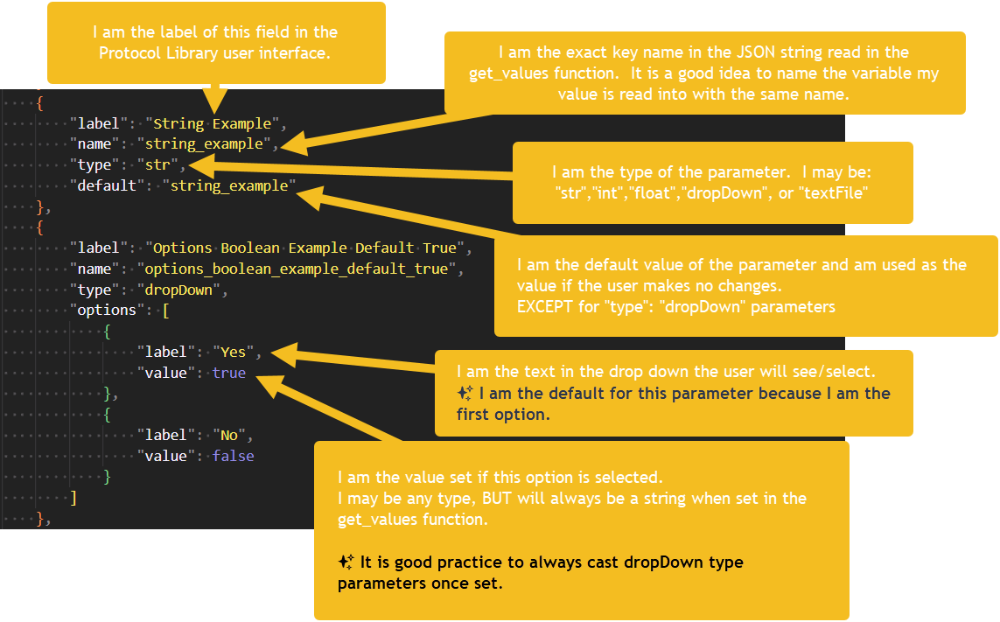

# Template for Protocol Library Parameters

> Protocol Library Parameters provide a user interface for setting variable values when downloading a protocol from the protocol library.

- protocol parameters are not required but greatly enhance the user experience if appropriate
- **If** a protocol has parameters uploaded to the protocol library
  - the download button on the protocol details page will present the user with a dialogue to set the values for the parameters
  - if the user makes no changes, the default values are used
  - the protocol file downloaded has the get_values function pre-pended (at line 1) in the protocol text with the values set in the dialogue

## Why use this template?

- It's a simple solution to use parameters (the `get_values` function) without needing to define a `get_values` function during development
- It alleviates the need to edit the protocol file before uploading to the protocol library
- It is aligned with common variable practices observed

## What parameters are available to you?

> Parameters are defined in JSON and uploaded to the protocol library with the protocol file.

## [pattern_parameters.json](pattern_parameters.json)

> The example parameters file

### What this example looks like on the protocol library

## [pattern.py](pattern.py)

> The example protocol file

- This file contains a code pattern for defining/reading parameters with or without a `get_values` function defined
- It is best practice to map variable names exactly to the parameter names
- If you define your variables/parameters as suggested then you may analyze the protocol and upload it to the protocol library without editing the protocol file.
